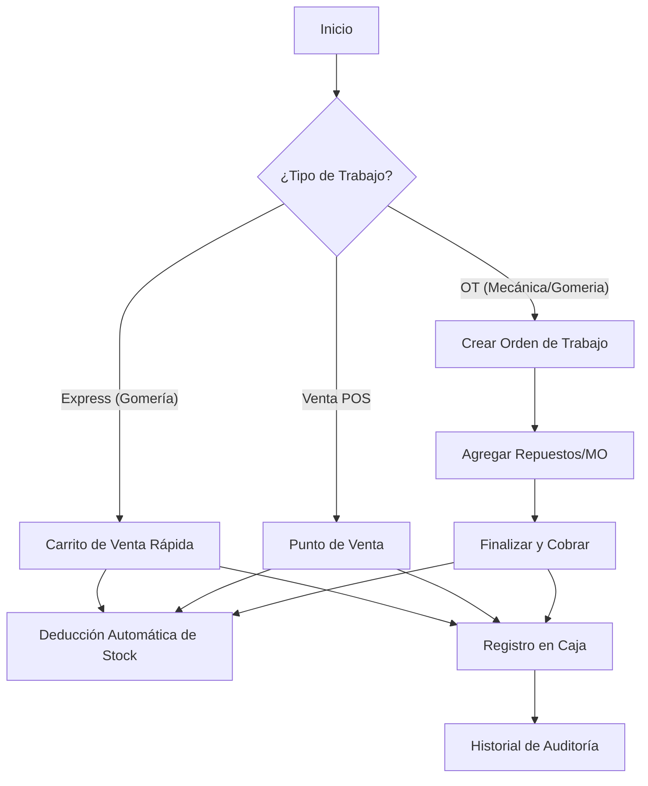

# Manual Técnico y Operativo - Piripi Pro 3.0

Este manual detalla cada botón, menú y lógica de trabajo del sistema, diseñado para que no quede ninguna duda sobre el funcionamiento "bajo el capó".

## 🛠️ Lógica de Trabajo General

El sistema opera bajo un ciclo de vida de datos que conecta el Inventario, la Mano de Obra y la Caja en tiempo real.

---

## 🖥️ 1. Dashboard (Panel de Control)
Es el "cerebro" del negocio. Aquí ves lo que está pasando *ahora*.

- **Botón "Nueva OT" (Superior Derecho):** Atajo rápido para abrir el modal de creación de órdenes.
- **Card "Ingresos Hoy":** Muestra el total acumulado de pagos registrados. Un clic aquí te lleva a los **Reportes**.
- **Indicador "Cajas Ocupadas":** Muestra cuántos de los 4 boxes tienen un vehículo "En Box".
- **Fichaje Rápido:** Lista de empleados y su estado (Entrada/Salida). El punto verde indica que están "En Reloj".

---

## 📝 2. Órdenes de Trabajo (OT)
Este módulo gestiona trabajos complejos.

### Botones en la Lista:
- **[EDITAR]:** Abre el modal para cambiar la descripción, el mecánico asignado o los precios. **Lógica:** Solo disponible mientras la OT no esté cobrada.
- **[+ PRODUCTO]:** Permite sumar más repuestos a una OT ya abierta sin entrar en el modo edición completo.
- **[FINALIZAR]:** Pasa la OT a estado "Finalizado". Desbloquea el botón de cobro.
- **Icono Basura (Rojo):** Solo para administradores. Borra la OT (Limpia el historial de ese vehículo).

### Modal "Nueva OT" - Detalles:
- **Buscador de Clientes:** Filtra por DNI, Nombre o **Patente**. Al elegir un cliente, el sistema carga automáticamente sus vehículos.
- **Rentabilidad MO (%):** Define cuánto del cobro de mano de obra es utilidad base.
- **Asignar Profesionales:** Al marcar varios mecánicos, el sistema **divide la comisión** equitativamente entre ellos al finalizar.

---

## 🏎️ 3. Gomería Express (Trabajos del Día)
Diseñado para velocidad. No requiere crear una OT formal si es un cambio rápido.

- **Botones de Servicios (Tarjetas):** Al tocarlos, suman el servicio al carrito.
- **Botón "+ PRODUCTO":** Abre el buscador de inventario para vender, por ejemplo, un litro de aceite suelto.
- **Lógica de Doble Clic:** Un clic suma uno. Si es el segundo servicio igual, el sistema puede aplicar descuentos configurados (ej: alineación + balanceo).

---

## 📦 4. Inventario y Stock
Control total de tu mercadería.

- **Tipo UNIT:** Productos que se cuentan por unidad (Filtros, Cubiertas).
- **Tipo VOLUME:** Productos líquidos (Aceite).
- **Lógica de Venta por Dinero ($):** Si eliges un aceite, el sistema te preguntará: "¿Mililitros o Dinero?". 
  - Si pones "$2000", el sistema calcula: `2000 / Precio_Litro = Litros_a_Descontar`.
  - **Botón Lector de Barras:** Activa la cámara para buscar productos sin escribir.

---

## 👤 5. Personal y Fichaje
- **Botón "Fichar":** Abre el teclado de PIN. Cada entrada/salida queda grabada con fecha y hora exacta.
- **Configuración de Comisiones:** En el menú de edición de usuario, puedes setear el % que gana cada uno por su trabajo.

---

## 🕵️ 6. Auditoría y Heatmap (Modo Programador)
- **Registro de Movimientos:** Muestra QUIÉN borró algo o QUIÉN cambió un precio.
- **Mapa de Calor:** Los botones con colores más intensos (rojo/naranja) son los que más se usan. Esto sirve para saber si los empleados están usando bien la plataforma.

---
**Nota de Lógica:** Todo cobro (OT o POS) genera un registro en la tabla `payments`. Un pago NO se puede borrar si ya está incluido en un **Cierre de Caja** (seguridad contable).
